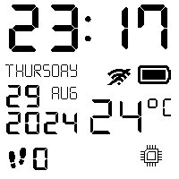
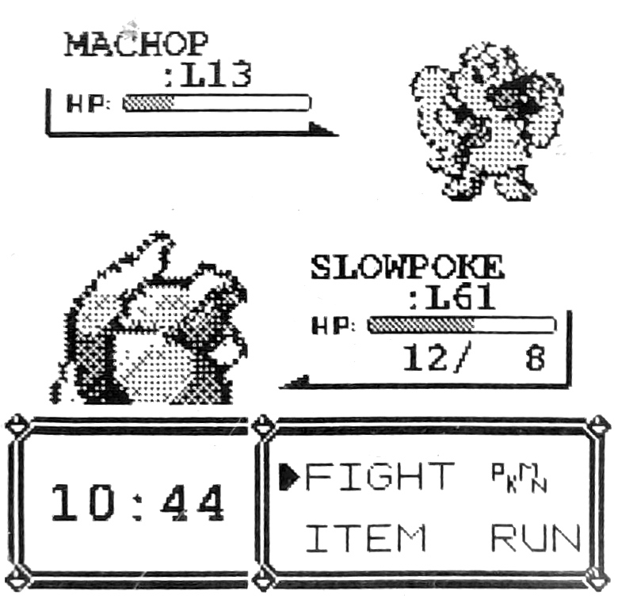
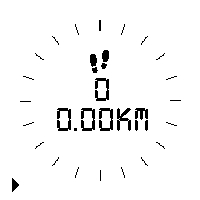
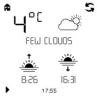
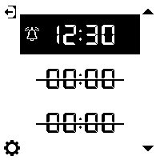
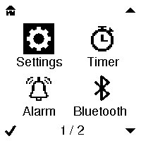
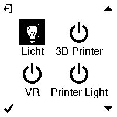
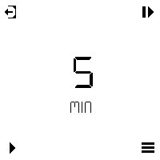

MiteOS  
A Watchy OS
======

Features
-----

✅ Multiple [Watchfaces](#builtin-watchfaces) (from other creators / relatively easy to add your own)  
✅ Timer  
✅ Alarm (up to 3 at a time)  
✅ Weather Information (Temperature / Moon Phase) **  
✅ Step Tracking (Remembers the Last 7 days)  
✅ Check Phone Notifications*  
✅ Media-Playback Info*  
✅ Home Assistant Integration (Lights / Switches) \*/*\*  
✅ Dark-/Lightmode (Static or Timed)  
✅ Configure Settings through Companion App *

\(*) Requires the Phone Companion App (see [Phone Companion](#phone-companion) for Restrictions)  
\(**) Requires a WiFi Connection

**Other Features**  
✅ App-Menu  
✅ NTP Time Syncing  
✅ Vibrate on Hour Change  
✅ Settings Menu on the watch (Still requires some stuff to be done through code or the app)

Planned Features
-----
- Weather Information through Phone instead of WiFi
- Activity Tracking (like running and stuff, based on the amount of steps coming in per second)
- TOTP
- Night-Mode (save battery at night or if it is not worn)
- Google Health Syncing

Phone Companion
-----
App can be found here: **Link coming soon**

**Restrictions:**
- Notifications get only synced every 15 minutes to save battery.
- Syncing is slow and takes a few seconds
- Only the watch can initiate a sync, so no in time notifications

Battery-Life
-----

| Battery  | Offline  | Wifi + Phone Connection (15 minute interval) |
|----------|----------|----------------------------------------------|
| 200mAh   | ~10 days | ~7 days                                      |
| 320mAh*  | -        | -                                            |
| 500mAh** | -        | -                                            |

(*) Requires a case that can hold that battery  
(**) Requires a case that can hold that battery / Its ordered but not here yet. (also not quite sure if im getting scammed on the real capacity :D)  
  
I use a modified version of https://github.com/yik3z/Watchy-CAD/tree/main/CAD/Cases/SlimV5 that allows for a 320mAh battery.

BuiltIn Watchfaces
-----
- [7_SEG](https://github.com/sqfmi/Watchy/tree/master/examples/WatchFaces/7_SEG) by SQFMI
- [Analog](https://github.com/BenjaminGabel/AnalogWatchFace) by BenjaminGabel
- [BTTF](https://github.com/peerdavid/wos) by peerdavid
- [Calendar](https://github.com/uCBill/Calendar_watchy) by uCBill
- [Hobbit Time](https://github.com/BraininaBowl/Hobbit-Time-for-Watchy) by BraininaBowl
- [MacPaint](https://github.com/sqfmi/Watchy/tree/master/examples/WatchFaces/MacPaint) by SQFMI
- [Pokemon 2.0](https://github.com/Klemek/watchy/tree/master/watchfaces/pokemon-2.0) by Klemek
- [Calendar] (https://github.com/uCBill/Calendar) by uCBill (Reworked by me)
- [Train](https://github.com/uCBill/Multi_face_Watchy/blob/main/train.h) by uCBill (based on [Bahn](https://github.com/BraininaBowl/Bahn-for-Watchy) by BraininaBowl)

All watchfaces have been modified by me to run on this OS. I also added light and darkmode to each of the watchfaces.  
If you are the author of any of these watchfaces and don't want me to distribute them, please contact me and i'll remove them immediatly.

Screenshots
-----

