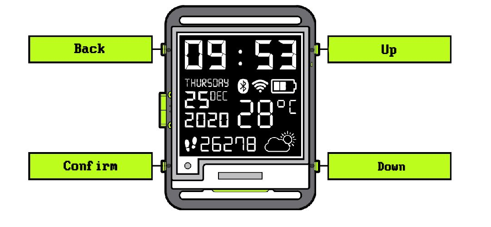
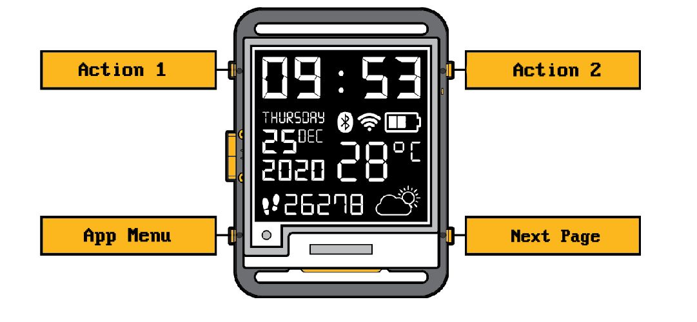

# Controls

This firmware tries to keep it simple, most of the time the inputs are the same:  
  

The Watchface deviates from this to allow for the action buttons:  
  

# Navigation
The firmware consists of 2 main areas, for once are navigatable pages, these are the Watchface, Weather and Step Counter. These are navigated by the watchface controls "Next Page" button.  

If a button has a function, it will get an icon displayed most of the time:  
  
In this case this matches the general control scheme.  
🛖 **Back** to the Watchface  
✔️ **Confirm** the selected app and start it  
🔺 Go **up** to the previous app  
🔻 Go **down** to the next app  